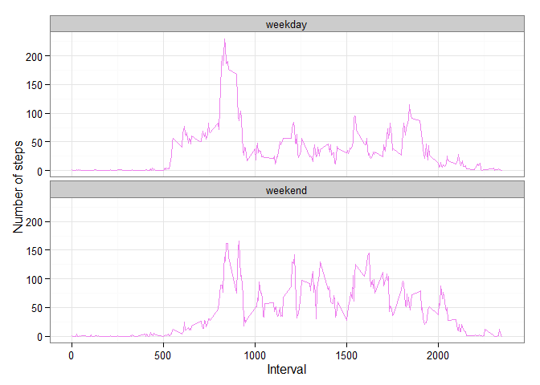

# Reproducible Research: Peer Assessment 1
Mohamad Nazir bin Ismail  
20 September 2015  

## Preparing the environmnet

### Load the libraries


```r
library(knitr)
opts_chunk$set(echo = TRUE, results = 'hold')
library(data.table)
library(ggplot2) # we shall use ggplot2 for plotting figures
```

## Loading and preprocessing the data

This assignment makes use of data from a personal activity monitoring device. This device collects data at 5 minute intervals through out the day. The data consists of two months of data from an anonymous individual collected during the months of October and November, 2012 and include the number of steps taken in 5 minute intervals each day.

This assignment instructions request to show any code that is needed to loading and preprocessing the data, like to:

Load the data (i.e. > read.csv())

Process/transform the data (if necessary) into a format suitable for your analysis

Loading the data using the following code:


### Preprocessing the data

Convert date field to Date class and interval field to Interval class


```r
rdata$date <- as.Date(rdata$date, format = "%Y-%m-%d")
rdata$interval <- as.factor(rdata$interval)
```

Check data using str() method


```r
str(rdata)
```

```
## 'data.frame':	17568 obs. of  3 variables:
##  $ steps   : num  NA NA NA NA NA NA NA NA NA NA ...
##  $ date    : Date, format: "2012-10-01" "2012-10-01" ...
##  $ interval: Factor w/ 288 levels "0","5","10","15",..: 1 2 3 4 5 6 7 8 9 10 ...
```


## What is mean total number of steps taken per day?

calculate the total steps per day.


```r
steps_per_day <- aggregate(steps ~ date, rdata, sum)
colnames(steps_per_day) <- c("date","steps")
head(steps_per_day)
```

```
##         date steps
## 1 2012-10-02   126
## 2 2012-10-03 11352
## 3 2012-10-04 12116
## 4 2012-10-05 13294
## 5 2012-10-06 15420
## 6 2012-10-07 11015
```

Histogram of the total number of steps taken per day.


```r
ggplot(steps_per_day, aes(x = steps)) + 
       geom_histogram(fill = "green", binwidth = 1000) + 
        labs(title="Histogram of Steps Taken per Day", 
             x = "Number of Steps per Day", y = "Number of times in a day(Count)") + theme_bw() 
```

 

Calculate the mean and median of the number of steps taken per day.


```r
steps_mean   <- mean(steps_per_day$steps, na.rm=TRUE)
steps_median <- median(steps_per_day$steps, na.rm=TRUE)
```

The mean is 1.0766189\times 10^{4} and the median is 1.0765\times 10^{4}.

## What is the average daily activity pattern?

We calculate the aggregation of steps by intervals of 5-minutes and convert the intervals as integers and save them in a data frame called ```steps_per_interval```


```r
steps_per_interval <- aggregate(rdata$steps, 
                                by = list(interval = rdata$interval),
                                FUN=mean, na.rm=TRUE)
#convert to integers
##this helps in plotting
steps_per_interval$interval <- 
        as.integer(levels(steps_per_interval$interval)[steps_per_interval$interval])
colnames(steps_per_interval) <- c("interval", "steps")
```

We make the plot with the time series of the average number of steps taken (averaged across all days) versus the 5-minute intervals:


```r
ggplot(steps_per_interval, aes(x=interval, y=steps)) +   
        geom_line(color="orange", size=1) +  
        labs(title="Average Daily Activity Pattern", x="Interval", y="Number of steps") +  
        theme_bw()
```

 

Now, we find the 5-minute interval with the containing the maximum number of steps:


```r
max_interval <- steps_per_interval[which.max(  
        steps_per_interval$steps),]
```

Maximum 835, 206.1698113 steps.

## Imputing missing values

### Total number of missing values

Can be calculated using `is.na()`


```r
missing_vals <- sum(is.na(rdata$steps))
```

Total number of missing values are 2304.

### Populating the missing values


```r
na_fill <- function(data, pervalue) {
        na_index <- which(is.na(data$steps))
        na_replace <- unlist(lapply(na_index, FUN=function(idx){
                interval = data[idx,]$interval
                pervalue[pervalue$interval == interval,]$steps
        }))
        fill_steps <- data$steps
        fill_steps[na_index] <- na_replace
        fill_steps
}

rdata_fill <- data.frame(  
        steps = na_fill(rdata, steps_per_interval),  
        date = rdata$date,  
        interval = rdata$interval)
str(rdata_fill)
```

```
## 'data.frame':	17568 obs. of  3 variables:
##  $ steps   : num  1.717 0.3396 0.1321 0.1509 0.0755 ...
##  $ date    : Date, format: "2012-10-01" "2012-10-01" ...
##  $ interval: Factor w/ 288 levels "0","5","10","15",..: 1 2 3 4 5 6 7 8 9 10 ...
```


Lets check if there is any remaining value that is missing.


```r
sum(is.na(rdata_fill$steps))
```

```
## [1] 0
```

Zero output means that there is no more missing value.

### A histogram of the total number of steps taken each day

The plot:


```r
fill_steps_per_day <- aggregate(steps ~ date, rdata_fill, sum)
colnames(fill_steps_per_day) <- c("date","steps")

##plotting the histogram
ggplot(fill_steps_per_day, aes(x = steps)) + 
       geom_histogram(fill = "blue", binwidth = 1000) + 
        labs(title="Histogram of Steps Taken per Day", 
             x = "Number of Steps per Day", y = "Number of times in a day(Count)") + theme_bw() 
```

 

Calculate and report the mean and median


```r
steps_mean_fill   <- mean(fill_steps_per_day$steps, na.rm=TRUE)
steps_median_fill <- median(fill_steps_per_day$steps, na.rm=TRUE)
```

The mean is 1.0766189\times 10^{4} and the median is 1.0766189\times 10^{4}.

### Do these values differ from the first part of the calculation?

Yes, these values do differ slightly.

## Are there differences in activity patterns between weekdays and weekends?

We do this comparison with the table with filled-in missing values.
1. Augment the table with a column that indicates the day of the week
2. Subset the table into two parts - weekends (Saturday and Sunday) and weekdays (Monday through Friday).
3. Tabulate the average steps per interval for each data set.
4. Plot the two data sets side by side for comparison.


```r
weekdays_steps <- function(data) {
    weekdays_steps <- aggregate(data$steps, by=list(interval = data$interval),
                          FUN=mean, na.rm=T)
    # convert to integers for plotting
    weekdays_steps$interval <- 
            as.integer(levels(weekdays_steps$interval)[weekdays_steps$interval])
    colnames(weekdays_steps) <- c("interval", "steps")
    weekdays_steps
}

data_by_weekdays <- function(data) {
    data$weekday <- 
            as.factor(weekdays(data$date)) # weekdays
    weekend_data <- subset(data, weekday %in% c("Saturday","Sunday"))
    weekday_data <- subset(data, !weekday %in% c("Saturday","Sunday"))

    weekend_steps <- weekdays_steps(weekend_data)
    weekday_steps <- weekdays_steps(weekday_data)

    weekend_steps$dayofweek <- rep("weekend", nrow(weekend_steps))
    weekday_steps$dayofweek <- rep("weekday", nrow(weekday_steps))

    data_by_weekdays <- rbind(weekend_steps, weekday_steps)
    data_by_weekdays$dayofweek <- as.factor(data_by_weekdays$dayofweek)
    data_by_weekdays
}

data_weekdays <- data_by_weekdays(rdata_fill)
```

Below you can see the panel plot comparing the average number of steps taken per 5-minute interval across weekdays and weekends:


```r
ggplot(data_weekdays, aes(x=interval, y=steps)) + 
        geom_line(color="violet") + 
        facet_wrap(~ dayofweek, nrow=2, ncol=1) +
        labs(x="Interval", y="Number of steps") +
        theme_bw()
```

 

We can see at the graph above that activity on the weekday has the greatest peak from all steps intervals. But, we can see too that weekends activities has more peaks over a hundred than weekday. This could be due to the fact that activities on weekdays mostly follow a work related routine, where we find some more intensity activity in little a free time that the employ can made some sport. In the other hand, at weekend we can see better distribution of effort along the time.
